# Benefits Of Living Abroad

The project provides an overview of the benefits of living abroad

Confidential information is not displayed. Images are custom.

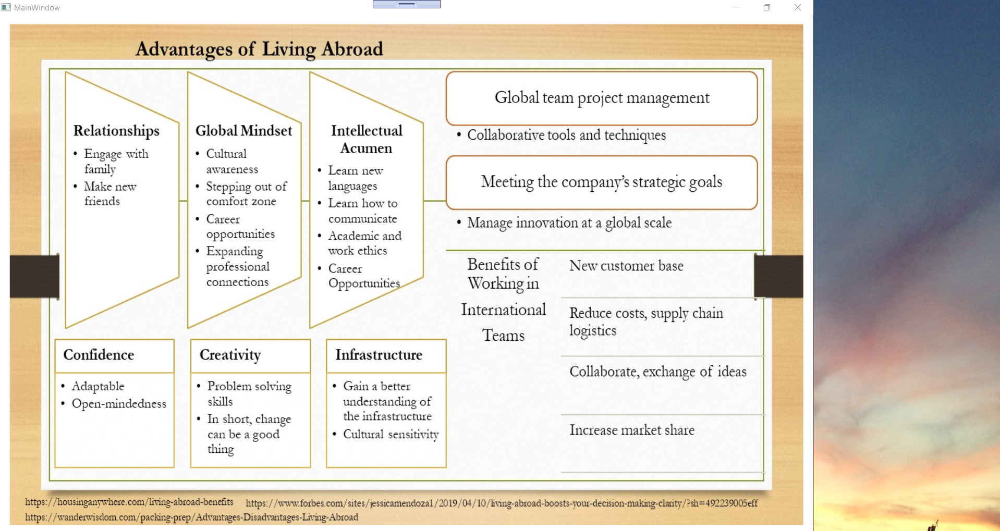

## Crossing boundaries - Religion
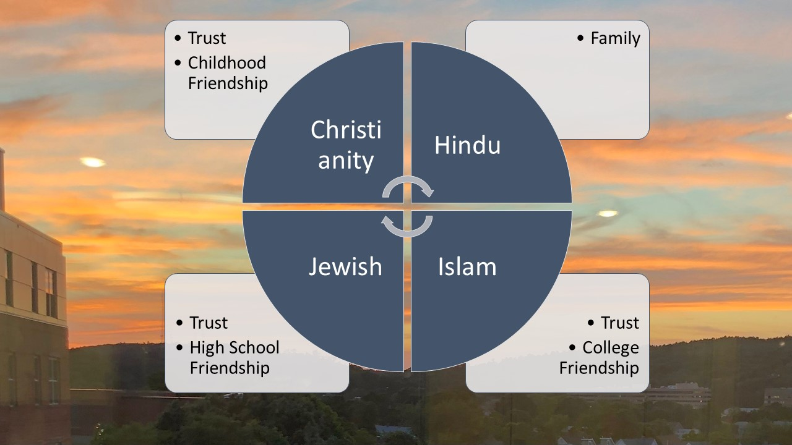

## Airports Growing up

## Living abroad
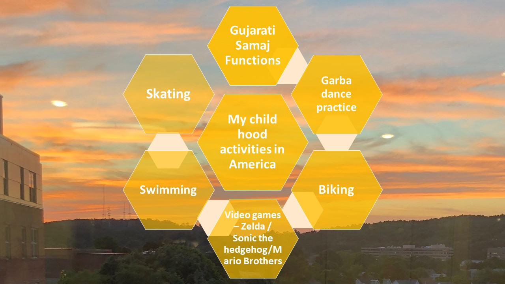

## SightSeeing Things to do
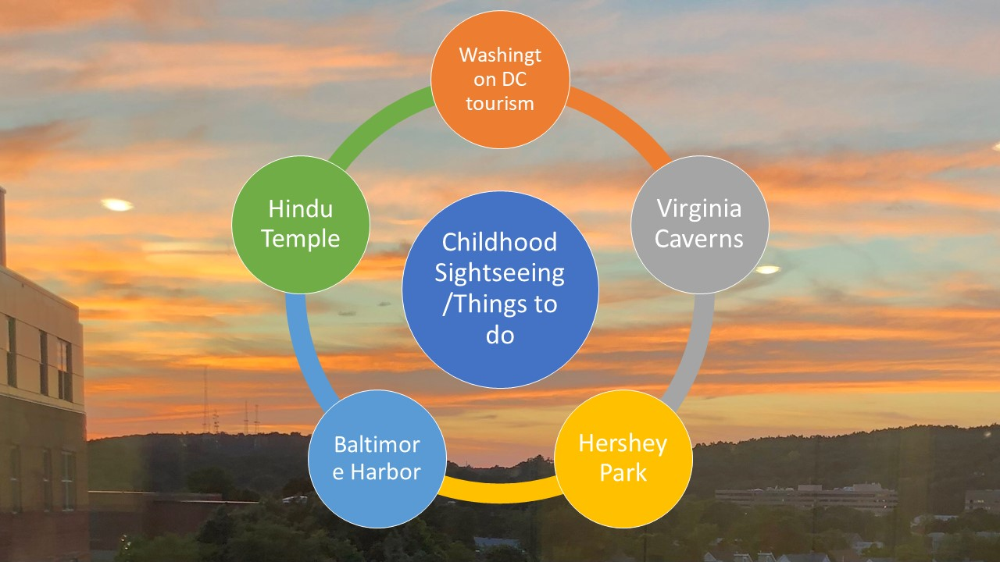

## Living abroad
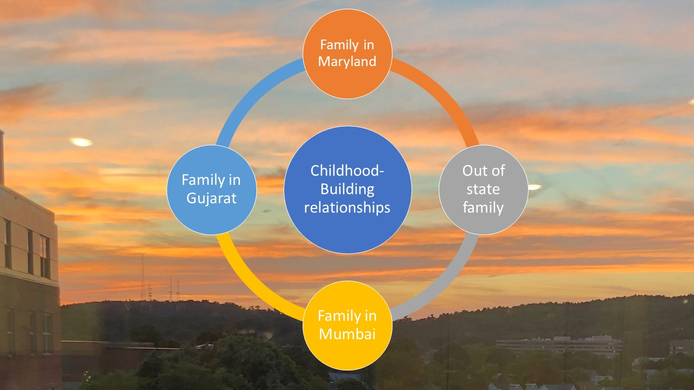

## Elementary School
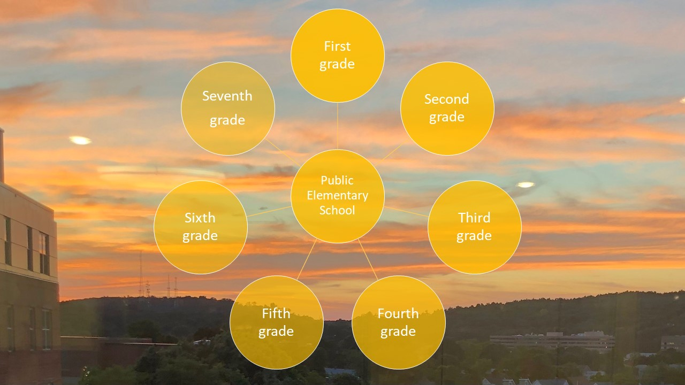

## Elementary School

## Gujarati Samaj
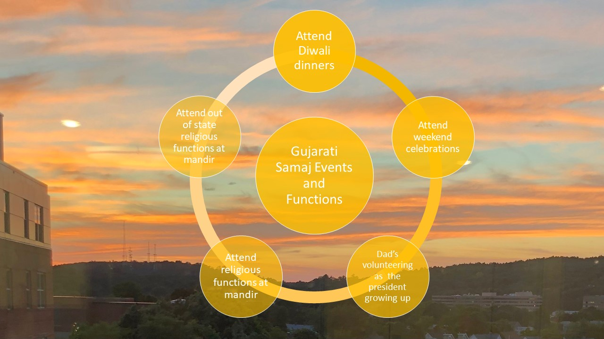

## Four Seasons
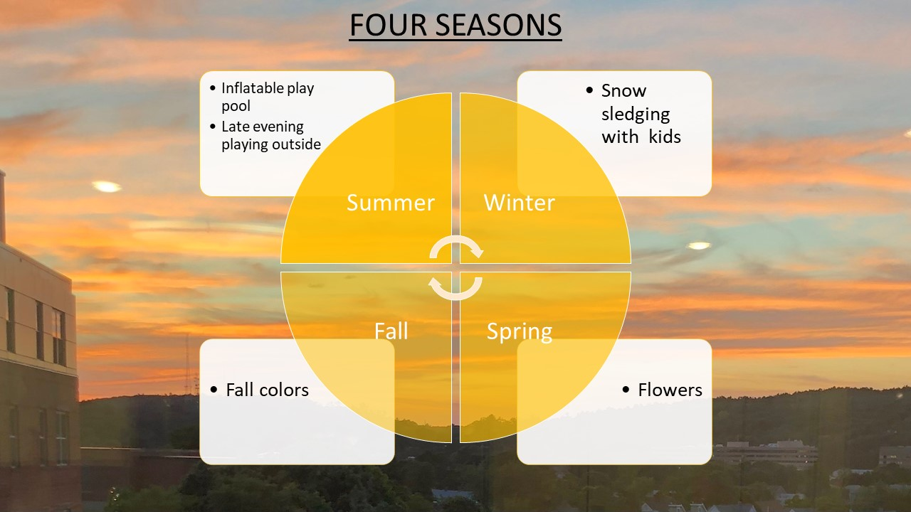

## Activities in Ahmedabad
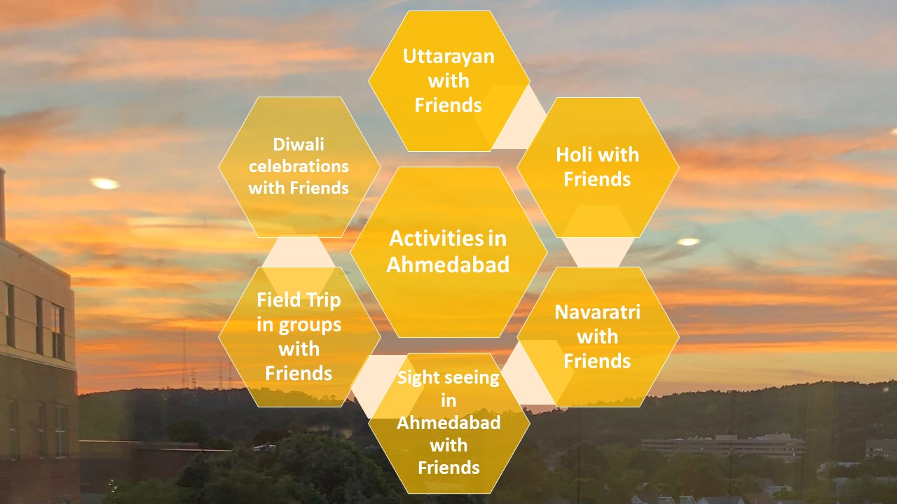

## Movies
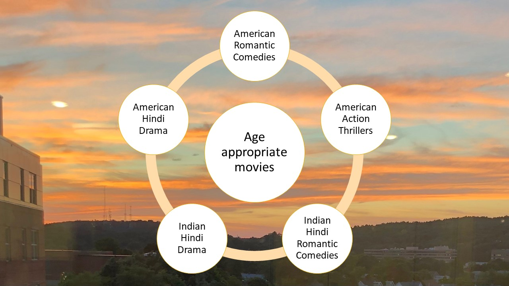

## Music
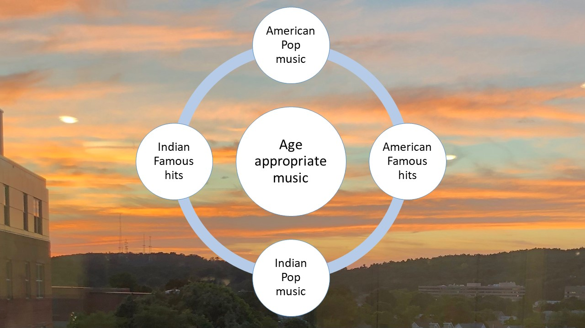

## Grandparents
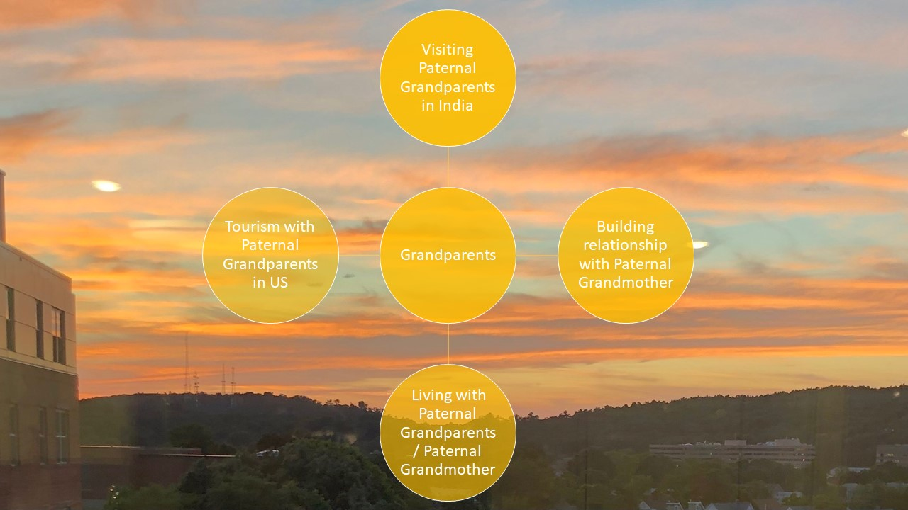

## Activities in Ahmedabad
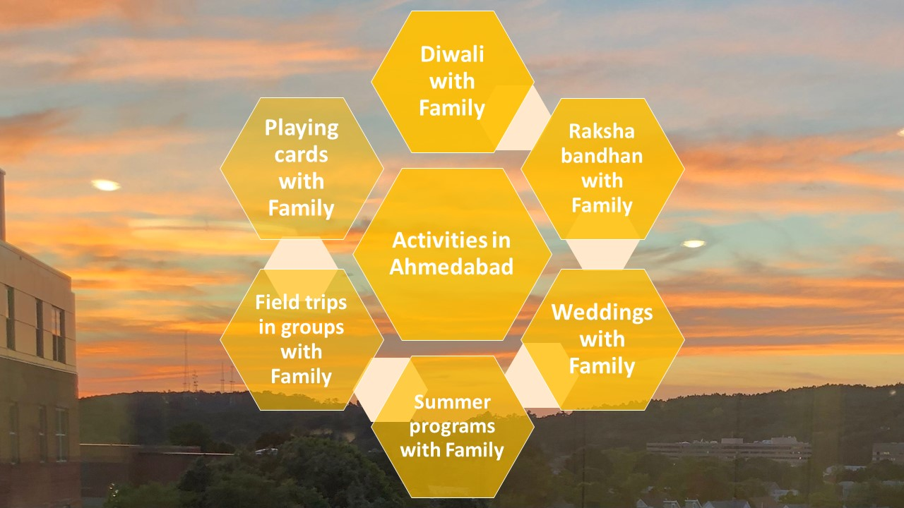

## Activities in Ahmedabad
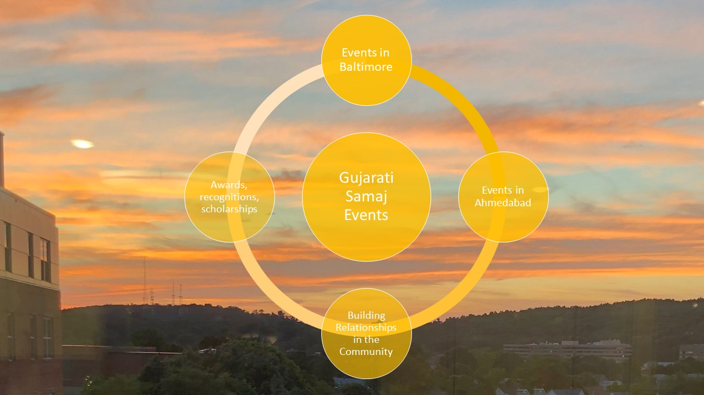

## Temples in Gujarat
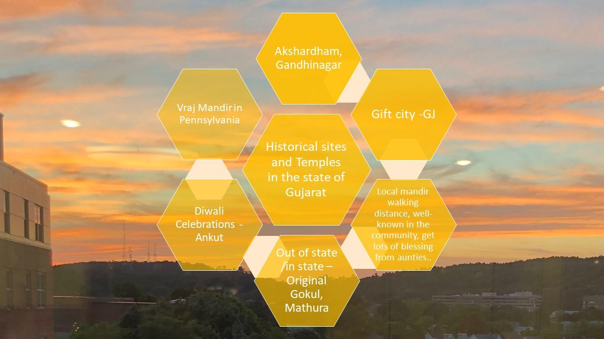

## Activities in New Jersey
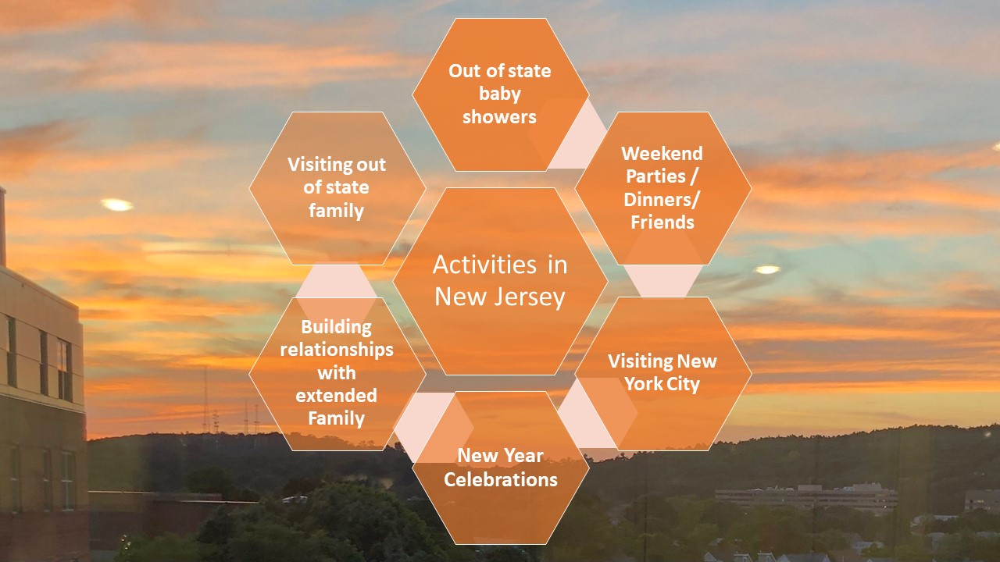

## Activities in Delhi

## Ethics and Excellence

Advanced knowledge reference https://github.com/alpaddesai/LifeStyle
